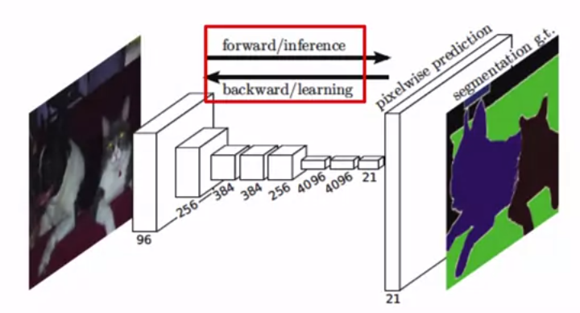
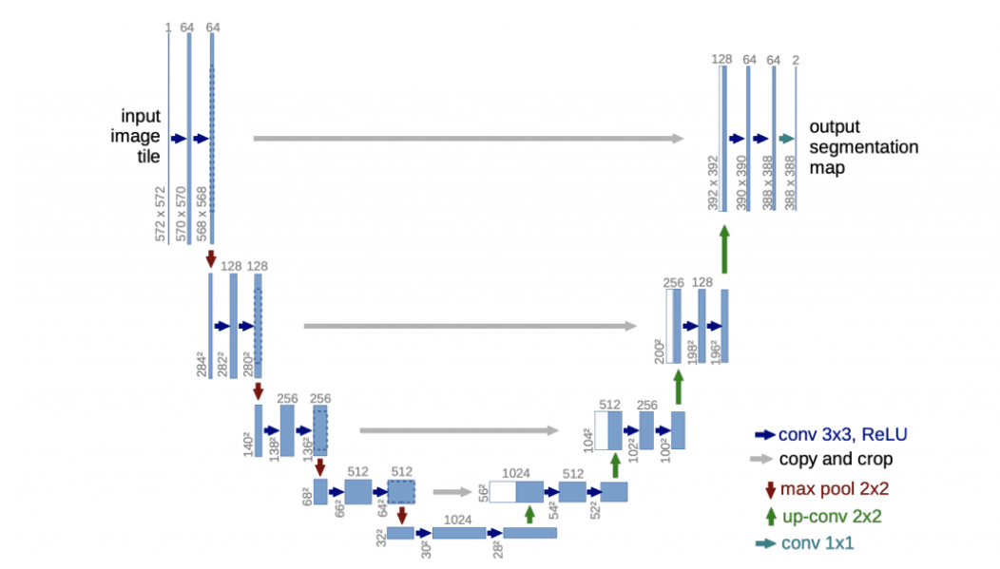

# Image Segmentation Tensorflow

In this repository, we review some concepts concerning Image segmentation and python implementation using Tensorflow. 

## Table of content

- [Image Segmentation](#image-segmentation)
- [( Semantic vs Instance ) Segmentation](#semantic-vs-instance-segmentation )
- [Image Segmentation Basic Architecture](#image-segmentation-basic-architecture)
- [Popular Architectures](#popular-architectures)
    - [Fully Convolutional Neural Networks (FCNs)](#fully-convolutional-neural-networks-fcns)
        - [Properties](#properties)
        - [FCN architecture](#fcn-architecture)
        - [FCNs in detail](#fcns-in-detail)
            - [Encoder](#encoder)
            - [Decoder](#decoder)
                - [FCN-32](#fcn-32)
                - [FCN-16](#fcn-16)
                - [FCN-8](#fcn-8)
            - [Upsampling](#upsampling)
        - [well-known networks based on FCN](#well-known-networks-based-on-fcn)
            - [SegNet](#segnet)
            - [UNet](#unet)
            - [Mask R-CNN](#mask-r-cnn)
- [Code Implementation (Tensorflow)](#code-implementation-tensorflow)
    - [Dataset](#dataset)
    - [Getting Started](#getting-started)

## Image Segmentation

Image segmentation is a computer vision task that involves dividing an image into meaningful and relevant regions or segments. The goal is to group together pixels or regions in the image that have similar characteristics such as color, texture, or intensity, while differentiating them from the surrounding areas.

| Original image                               | Segmentation Output                          |
| -------------------------------------------  | -------------------------------------------- |
|                |                |

## ( Semantic vs Instance ) Segmentation 

- Semantic segmentation focuses on labeling each pixel with a class label, providing a high-level understanding of the image.
- Instance segmentation aims to not only assign class labels but also differentiate individual instances of objects, providing a more detailed and precise segmentation.

| Semantic segmentation                         | Instance segmentation                          |
| -------------------------------------------   | -------------------------------------------- |
| |                |

## Image Segmentation Basic Architecture

Let's explore the basic architecture for a model that can be used for segmentation. 
 
The high level architecture for an image segmentation algorithm is an encoder-decoder one. 

 - **input image**: It works by taking an input image which has a set of dimensions, such as 224 by 224 by 3 for a color red, green, blue one. 
 - **encoder**: The image is processed with an encoder. An encoder is a feature extractor. And for image processing, it's typical to use a CNN to extract features. The encoder extracts features from the image into a feature map. The earlier layers extract low level features such as lines and these lower level features are successfully aggregated into higher level features such as eyes and ears. The aggregation of successful higher level features is done with the help of downsampling. 
 - **decoder**: The image segmentation architecture will take the downsampled feature map and feed it to a decoder. The decoders task is to take the features that were extracted by the encoder and work on producing the models output or prediction. The decoder is also a convolutional neural network. The decoder assigns intermediate class labels to each pixel of the feature map, and then up samples the image to slowly add back the fine grained details of the original image. The decoder then assigns more fine grained intermediate class labels to the up samples pixels and repeats this process until the images up sampled back to its original input dimensions. The final predicted image also has the final class labels assigned to each pixel.
- **pixel wise labeled map**: This then gives a pixel wise labeled map. In this example, the pixel wise labeled map will be the size of the original image. For example, 224 by 224, with the third dimension being the number of classes. So each slice of 224 by 224 will be the mappings of the pixels for that particular class.

- **Algorithm**

    - **Encoder**
        - CNN without fully connected layes
        - Aggregates low level features to high level features

    - **Decoder**: 
        - Replaces fully connected layers in a CNN
        - Up samples image to original size to generate a pixel mask

## Popular Architectures

- ### Fully Convolutional Neural Networks (FCNs)
    
    - #### Properties
        - Replace the fully connected layers with convolutional layes
        - Earlier conv layers: Feature extraction and down sampling
        - Later conv layers: up sample and pixel-wise labelmap

    - #### FCN architecture
        
        This is an illustration of the architecture from the original paper. It shows an example of how filters are learned in the usual way through forward inference and backpropagation. At the end is a pixel-wise prediction layer that will create the segmentation map.
        
        
        The decoder has a number of options:

        

        - Fully convolutional neural networks, encoders are feature extractors like the feature extracting layers using object detection models. So you can reuse the layers of well-known object detection models as the encoder of the fully connected network. For example, VGG16, ResNet 50, or MobileNet, have pre-trained feature extraction layers that you can use.
        - The decoder part of the FCN is usually called FCN-32, FCN-16 or FCN-8 with a number denotes the stride size during upsampling. You may recall that the stride in a convolutional layer determines how many pixels to shift the sliding window as it traverses the image. The smaller the stride, the more detailed the processing. The difference between the decoder architectures ends up effectively being the resolution of the final pixel map. You can see that here as the resolution improves, as the strike decreases from 32-16 and then to 8, and 8 is the closest to the ground truth
    
    - #### FCNs in detail:
        The model will learn the key features of the image using a CNN feature extractor, which is considered the encoder part of the model. As the image passes through convolutional layers, it gets downsampled. Then the output is passed to the decoder section of the model, which are additional convolutional layers. The decoder layers upsamples in the image step-by-step to its original dimensions so that we get a pixelwise labeling, also called pixel mask or segmentation mask of the original image.

        - ##### Encoder

            The encoder can use the convolutional layers of a traditional CNN architecture. Note that the fully connected layers of these traditional CNN models are used for classification in object detection tasks, so the encoder of the image segmentation models won't reuse those fully connected layers. Common architectures that it can reuse are VGG-16, ResNet-50, and MobileNet. But of course, you can design and use your own!

            

        - ##### Decoder

            What allows you to take the CNN from the encoder and turn it into an architecture that gives you image segmentation is the decoder. Popular decoders like that we'll look at in detail are FCN-32, FCN-16, and FCN-8. Their outputs are shown in the original paper right here. Let's look at these in detail, and we'll start with FCN-32.

            

            As a quick review that might help you understand the decoder, let's review what happens with a pooling layer. As an example, I'm going to start with a tiny image here that has eight pixels and two columns and four rows. If you perform pooling with a window size of 2 by 2, such as average pooling, the first application of the pooling window applies to the top four cells of the image, and it pools the four values into a single value. If you choose a stride of 2 by 2, the pooling window will slide two cells down. Then the pooling as applied to the bottom four cells of the image, and it pools the image into a single value that you can see here. Notice that the input image has four rows, but the pooling result has two rows. Also notice that the input image had two columns, but the pooling result has one column. If you have a pooling layer with a 2 by 2 pooling window on a stride of 2 by 2, the result of your pooling will reduce the height and width by half.

            

            - ##### FCN-32
                Let's look at the FCN-32 decoder architecture. Recall, like we just said, that when you pool an image with a 2 by 2 window size and a stride of 2 by 2, you'll reduce the image in half along each axis, so 256 by 256 image would get pooled to 128 by 128 and so on. The architecture has five pooling layers. Each pooled result gets its dimensions reduced by half, five times. The original image gets reduced by a factor of 2_5 of 32. If the output of the final pooling layer, which we're calling pool 5, is upsampled back to the original image size, it needs to be upsampled by a factor of 32. This is done by upsampling with a stride size of 32, which means that each input pixel from Pool 5 is turned into a 32 by 32 pixel output. This 32 times upsampling is also the pixelwise prediction of classes for the original image. That's what the FCN-32 decoder does, and that's where it gets its name from.

                
                
            - ##### FCN-16
                FCN-16 works similarly to FCN-32, but in addition to using pool 5, it also uses pool 4. In step 1, the output of pool 5 is upsampled by a factor of two, so the result has the same height and width as pool 4. Separately, we use the output of pool 4 to make a pixelwise prediction using a one by one convolution layer. But don't worry about the details of that one by one convolutional layer yet, we'll look into that a little later. The pool 4 prediction is added to the 2x upsampled output of pool 5. The output of this addition is then upsampled by a factor of 16 to get the final pixelwise segmentation map. Upsampling with a stride of 16 takes each input pixel and outputs a 16 by 16 grid of pixels, so this decoder type is named FCN-16.

                
            
            - ##### FCN-8
                
                FCN-8 decoder works very similar with the same first two steps, but instead of upsampling the summation of the pool 4 and 5 predictions by 16, it will 2x upsample it, and then add that to the pool 3 prediction. This is then upsampled by eight, and hence the decoder is named FCN-8. Going back to [this image](#decoder), we can see the impact of this by factoring in the results from pools earlier in the architecture, when the image is at a higher resolution, our segments are better defined. Thus, the FCN-8 looks better than the FCN-16, and better than the FCN-32. Of course, depending on your scenario, the FCN-32 might be enough, but it might not be worth the extra processing required to do FCN-16 or FCN-8.

                

        - ##### Upsampling
            - Upsampling is increasing height and width of the feature map.
            - Two types of layers used in Tensorflow:
                - Simple Scaling - UpSampling2D
                    - Nearst: copies value from nearset pixel 
                    - Bilinear: linear interpolation from nearby pixels 
                - Transposed Convolutional(Deconvolution) - Conv2DTranspose 
                    
    - #### well-known networks based on FCN:
        - ##### SegNet

            
            
            SegNet Is very similar to the fully connected CNN with a notable optimization. That is that the encoder layers are symmetric with the decoder layers. They like mirror images of each other with the same number of layers and the same arrangement of those layers. For example, for each pooling layer that downsampled in the encoder, there was an upsampling layer and the decoder section. For example, in this architecture, the first segment has two convolutional layers, followed by a pooling layer. The last segment is a mirror image of this with an upsampling layer followed by two convolutional layers. The same symmetry is found in the second layer and the second-to-last one, and so on for the rest of the image
        - ##### UNet

            

            U-Net is another popular architecture for semantic segmentation. It's also symmetric, meaning the number of stages or upsampling and downsampling are equal. The name U-Net describes the shape of this architecture.

        - ##### Mask R-CNN

            

            Mask R-CNN is another popular architecture for instance segmentation. It builds off of the faster R-CNN. Mask R-CNN adds an additional branch after the feature extraction and faster R-CNN to perform upsampling to produce pixel-wise segmentation mosques of the image. It turns the object detection model into an image segmentation model.

## Code Implementation (Tensorflow)
    
- ### Dataset
    You will train the model on a [custom dataset](https://drive.google.com/file/d/0B0d9ZiqAgFkiOHR1NTJhWVJMNEU/view?usp=sharing) prepared by [divamgupta](https://github.com/divamgupta/image-segmentation-keras). This contains video frames from a moving vehicle and is a subsample of the [CamVid](http://mi.eng.cam.ac.uk/research/projects/VideoRec/CamVid/) dataset.

    classes: 
    | Value  | Class Name    |
    | -------| -------------|
    | 0      | sky |
    | 1      | building      |
    | 2      | column/pole      |
    | 3      | road |
    | 4      | side walk     |
    | 5      | vegetation      |
    | 6      | traffic light |
    | 7      | fence      |
    | 8      | vehicle     |
    | 9      | pedestrian |
    | 10      | byciclist      |
    | 11      | void      |
- ### Getting Started
    To get started with this project, follow these steps:

    1. Click this link to open the notebook in Colab: https://colab.research.google.com/github/barzansaeedpour/image-segmentation-tensorflow/blob/main/Image-segmentation-VGG16-FCN8-CamVid.ipynb

    2. The instruction and explaination of the code is mentioned in the notebook

